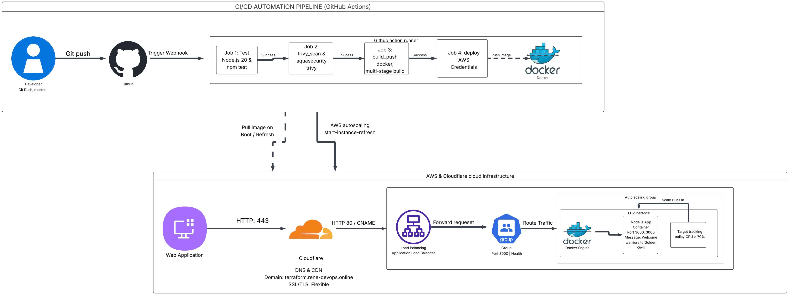

# Golden Owl DevOps Internship - Technical Test Submission

[](https://github.com/HuuHan12/goldenowl-devops-internship-challenge/actions/workflows/ci-cd.yml)
[](https://hub.docker.com/r/huuhan16/goldenowl-app)
[](https://aws.amazon.com/)
[](https://www.terraform.io/)
[](https://cloudflare.com/)

> **Candidate:** Doan Huu Han  
> **Repository:** [https://github.com/HuuHan12/goldenowl-devops-internship-challenge](https://github.com/HuuHan12/goldenowl-devops-internship-challenge)  
> **Live Deployment URL:** [https://terraform.rene-devops.online](https://terraform.rene-devops.online)  

---

## 📌 Submission Overview

| Requirement | Implementation Details | Status |
|---|---|:---:|
| **Live Application URL** | [https://terraform.rene-devops.online](https://terraform.rene-devops.online) | ✅ Done |
| **Docker Hub Image** | [`huuhan16/goldenowl-app:latest`](https://hub.docker.com/r/huuhan16/goldenowl-app) | ✅ Done |
| **Final Docker Image Size** | **`61.1 MB`** (Optimized via Multi-stage Node.js 20 Alpine) | ✅ Done |
| **Visual Flow Diagram** | [`docs/architecture-diagram.png`](./docs/architecture-diagram.png) (Manually created) | ✅ Done |
| **CI/CD Automation** | GitHub Actions ([`.github/workflows/ci-cd.yml`](./.github/workflows/ci-cd.yml)) | ✅ Done |
| **Infrastructure as Code** | 100% Terraform ([`terraform/`](./terraform/)) | ✅ Done |
| **Load Balancing & Auto Scaling** | AWS ALB + Auto Scaling Group (Target Tracking CPU 70%) | ✅ Done |
| **Security Scanning (Bonus ⭐)** | Aquasecurity Trivy integration (CRITICAL & HIGH filter) | ✅ Done |
| **HTTPS Support (Bonus ⭐)** | Edge SSL via Cloudflare DNS Proxy | ✅ Done |
| **Zero-Downtime CD (Bonus ⭐)** | AWS ASG Instance Refresh rolling update | ✅ Done |

---

## 🎨 Visual Flow Diagram

The complete end-to-end architecture and pipeline workflow was manually designed and illustrated below:



### Architecture Highlights
1. **CI/CD Pipeline Flow (GitHub Actions):**
   - **Trigger:** Automated unit testing runs on any push (`**`).
   - **Test Stage:** Node.js 20 environment executes `npm ci && npm test` (Jest suite).
   - **Vulnerability Scanning:** Aquasecurity Trivy scans container image for `CRITICAL,HIGH` CVEs before deployment.
   - **Registry Publish:** On merge to `master`, builds and tags image with both `latest` and `commit-sha`, then pushes to Docker Hub.
   - **Automated Rolling CD:** Triggers `aws autoscaling start-instance-refresh` to update ASG instances with zero downtime (`MinHealthyPercentage: 50`, `InstanceWarmup: 120`).

2. **Cloud Infrastructure Flow (AWS + Cloudflare):**
   - **DNS & Edge SSL:** User traffic arrives at `https://terraform.rene-devops.online` with HTTPS encryption handled by Cloudflare Edge SSL.
   - **Traffic Routing:** Cloudflare proxies requests to the AWS Application Load Balancer (ALB).
   - **High Availability & Scaling:** ALB forwards traffic to the Target Group containing EC2 instances (`t3.micro`) inside an Auto Scaling Group across multiple Availability Zones.
   - **Dynamic Elasticity:** ASG automatically scales out/in between 1 and 2 instances based on a 70% CPU Target Tracking scaling policy.
   - **Least-Privilege Security:** EC2 security groups only accept HTTP traffic from the ALB security group on port 3000; direct public access to EC2 is restricted.

---

## 🐳 Docker Image Optimization

The application image was optimized to achieve a minimal footprint of **`61.1 MB`** (compared to standard Node.js images of ~1GB):

- **Base Image:** `node:20-alpine` (lightweight Alpine Linux distribution).
- **Multi-Stage Build:**
  - `Stage 1 (build)`: Installs only production dependencies via `npm ci --only=production`.
  - `Stage 2 (runtime)`: Copies pre-built `node_modules` into a clean Alpine container, discarding build tools, caches, and test files.
- **Security Best Practices:** Runs as non-root user (`USER node`).
- **Clean Context:** Configured `.dockerignore` to exclude `.git`, `node_modules`, test suites, and temporary artifacts from the build context.

```bash
# Verify image size
docker pull huuhan16/goldenowl-app:latest
docker images huuhan16/goldenowl-app:latest
# REPOSITORY                  TAG       IMAGE ID       SIZE
# huuhan16/goldenowl-app      latest    0d36a168b375   61.1MB
```

---

## 🛠️ Infrastructure as Code (Terraform)

All AWS cloud resources are 100% provisioned via Terraform located in [`terraform/`](./terraform/):

- `main.tf`: Defines AWS Provider (`ap-southeast-1`), VPC, Security Groups, ALB, Target Group, Launch Template, Auto Scaling Group, and Target Tracking Scaling Policy.
- `variables.tf`: Parameterized settings for AWS region, instance type (`t3.micro`), container port (3000), domain name, and Docker image.
- `outputs.tf`: Outputs public ALB DNS name and application URL.

---

## 🧪 Verification & Live Testing

You can verify the running application through the live endpoint:

```bash
curl https://terraform.rene-devops.online
```

**Expected Response:**
```json
{"message":"Welcome warriors to Golden Owl!"}
```

---

# Original Assignment: Golden Owl DevOps Internship - Technical Test

At Golden Owl, we believe in treating infrastructure as code and automating resource provisioning to the fullest extent possible. 

In this technical test, we challenge you to create a robust CI build pipeline using GitHub Actions. You have the freedom to complete this test in your local environment.

## Your Mission 🌟
Your mission, should you choose to accept it, is to build a CI/CD pipeline and deploy the application by:
1. Forking this repository to your personal GitHub account.
2. Dockerizing a Node.js application, keeping the image **as lightweight as possible** (Please state the final image size in your repository's README so we can see the result of your optimization).
3. Establishing an automated CI/CD build process using GitHub Actions workflow and a container registry service such as DockerHub or Amazon Elastic Container Registry (ECR) or similar services.
4. Initiating CI tests automatically when changes are pushed to the feature branch on GitHub.
5. Utilizing GitHub Actions for Continuous Deployment (CD) to deploy the application to major cloud providers like AWS EC2, AWS ECS or Google Cloud (please submit the deployment link).
6. Deploying the application behind a **load balancer** with **auto scaling** enabled.
7. Provisioning **all cloud infrastructure using Infrastructure as Code (IaC)** such as Terraform, AWS CloudFormation, AWS CDK, or Pulumi. Resources created manually through the cloud console will not be accepted. 
8. Providing a **visual flow diagram** of your workflow and architecture, **created by you without the use of AI** (see [Visual Flow Diagram](#visual-flow-diagram-required-) below).

## Visual Flow Diagram (Required) 🎨
A `visual flow diagram` is **mandatory** for this test. It must illustrate the sequence of tasks you performed and the architecture you deployed, including:
- The CI/CD flow
- The deployed application's infrastructure

**The diagram must be created manually by you and must not be generated by AI.** This means no AI image generators and no AI tools that produce a diagram from a text prompt or from your code. 

Reference tools for creating visual flow diagrams:
- https://www.drawio.com/
- https://excalidraw.com/
- https://www.eraser.io/

## The Bigger Picture 🌏
This test is designed to evaluate your ability to implement modern automated infrastructure practices while demonstrating a basic understanding of Docker. In your solution, we encourage you to prioritize readability, maintainability, and the principles of DevOps.

## How We Evaluate 🎯
| Area | Weight |
|---|---|
| CI/CD pipeline (tests on push, build, push to registry, deploy) | 25% |
| Deployment works behind a load balancer with a real auto scaling policy | 25% |
| Visual flow diagram (accurate, manually created) | 20% |
| Infrastructure as code / repo quality / commit history | 20% |
| Docker image optimization (size, multi-stage, non-root, .dockerignore) | 10% |

## Bonus (Optional) ⭐
- Image vulnerability scan in CI (e.g. Trivy)
- HTTPS on the load balancer
- Automatic rollback on failed deployment
- Infrastructure defined with Terraform

## Submission Guidelines 📬
Your solution should be showcased in a public GitHub repository. We encourage you to commit early and often. We prefer to see a history of iterative progress rather than a single massive push. 

Your submission must include:
- The URL of your public GitHub repository
- The deployment link of your running application
- The visual flow diagram (manually created, not AI-generated)
- The final Docker image size

When you've completed the assignment, kindly share these with us.

## Running the Node.js Application Locally 🏃‍♂️
This is a Node.js application, and running it locally is straightforward:
- Navigate to the `src` directory by executing `cd src`.
- Install the project's dependencies listed in the package.json file by running `npm i`.
- Execute `npm test` to run the application's tests.
- Start the HTTP server with `npm start`.

You can test it using the following command:
```shell
curl localhost:3000
```
You should receive the following response:
```json
{"message":"Welcome warriors to Golden Owl!"}
```

Are you ready to embark on this DevOps journey with us? 🚀 Best of luck with your assignment! 🌟